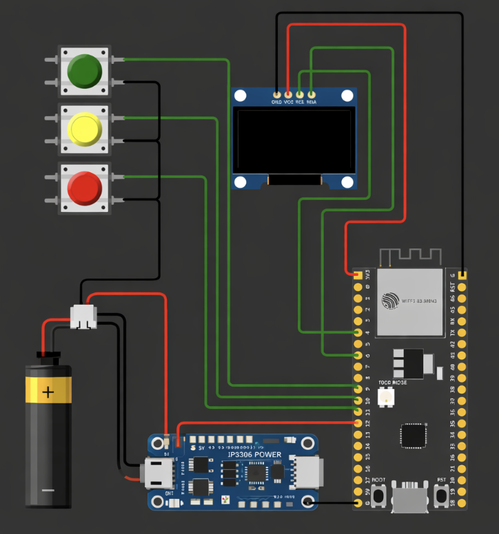

# Spotify-dev
A little handheld device which  brings back those Walkman vibes while working as the Spotify thing 

I built this project because I love listening to music and wanted a **dedicated device for Spotify** that feels physical and nostalgic rather than using a phone.

## CAD Designs

## Circuit Diagram 

## Schematics 

## BOM

| Item No. | Component Name        | Quantity | Description / Specs        | Supplier            |
|----------|----------------------|----------|----------------------------|---------------------|
| 1        | IP5306 Module        | 1        | Power management module    | Robu                |
| 2        | Battery with BMS     | 1        | Li-ion battery + protection| Quartz Components   |
| 3        | Jumper Wires         | 1 set    | Male/Female connectors     | Robu                |
| 4        | XIAO ESP32           | 1        | Microcontroller board      | Robocraze           |
| 5        | 1.8" TFT Display     | 1        | SPI display module         | Robu                |
