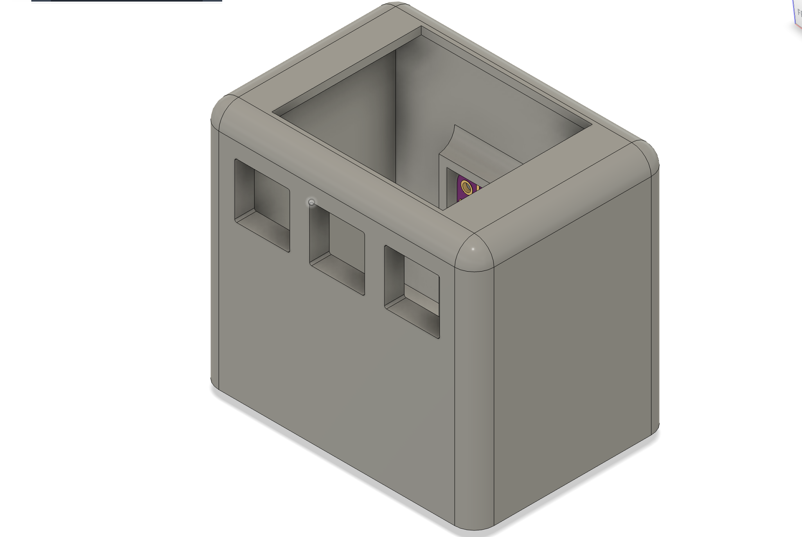
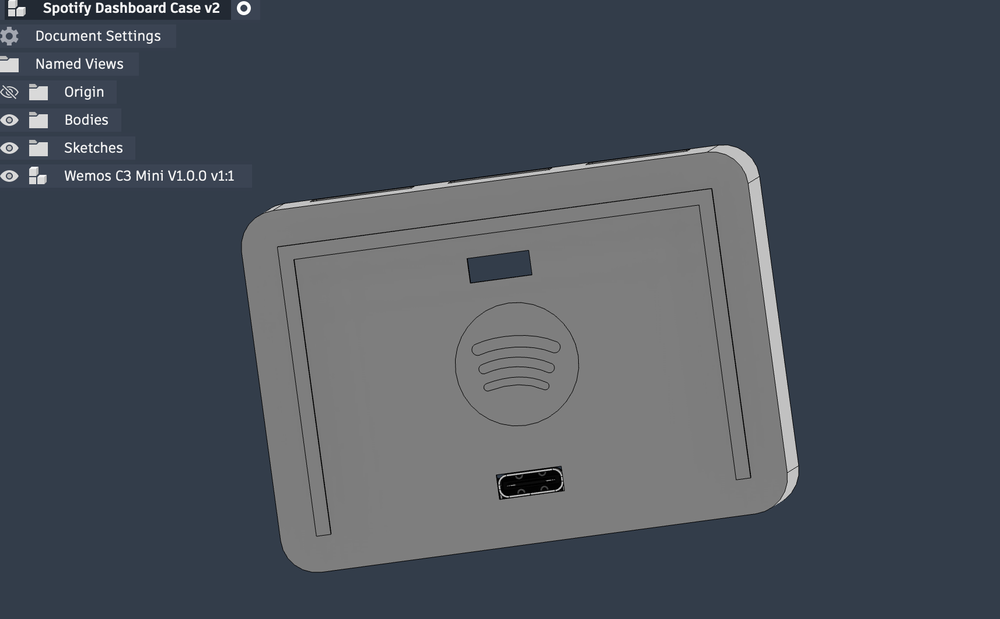
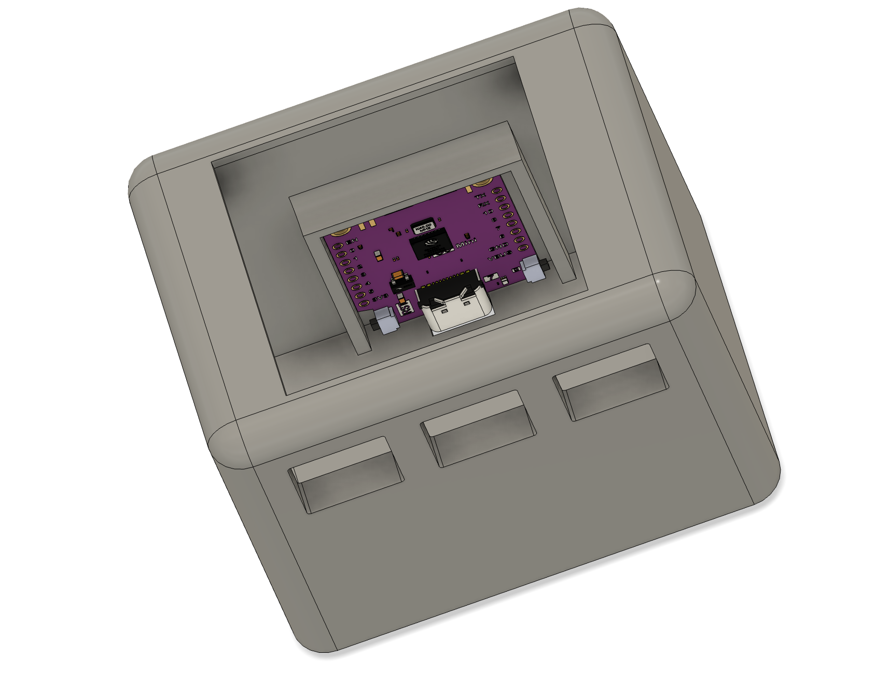
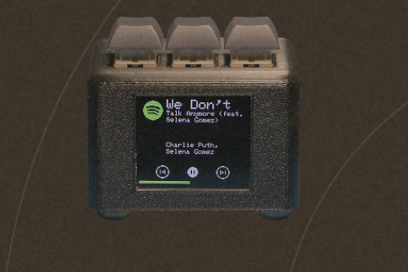
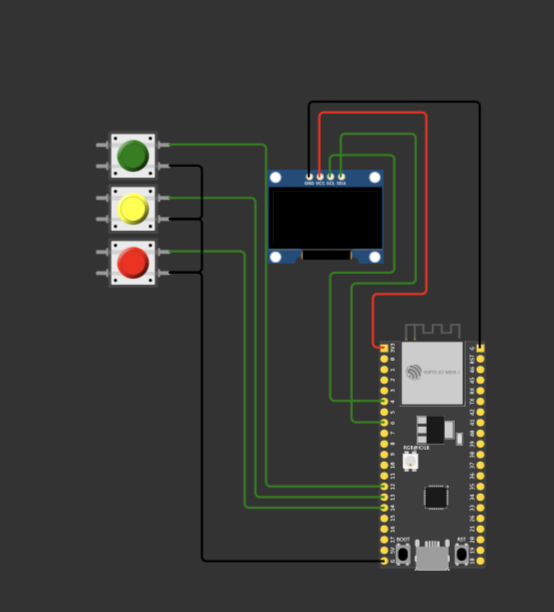

# Spotify-dev
A little handheld device which  brings back those Walkman vibes while working as the Spotify thing 

I built this project because I love listening to music and wanted a **dedicated device for Spotify** that feels physical and nostalgic rather than using a phone.

## CAD Designs

## Circuit Diagram 

## Schematics 

## BOM

- IP5306 Module: https://robu.in/product/type-c-usb-5v-2a-step-up-boost-converter-with-usb-charger/
- Battery: https://quartzcomponents.com/products/3-7v-800mah-li-po-rechargeable-battery
- ESP32: https://robu.in/product/esp32-c3-development-board-with-soldering/
- TFT Display: https://robu.in/product/62060/
- Jumper Wires: https://robu.in/product/10cm-female-female-breadboard-jumper-dupont-2-54mm-1p-1p-cable-40-pcs/

